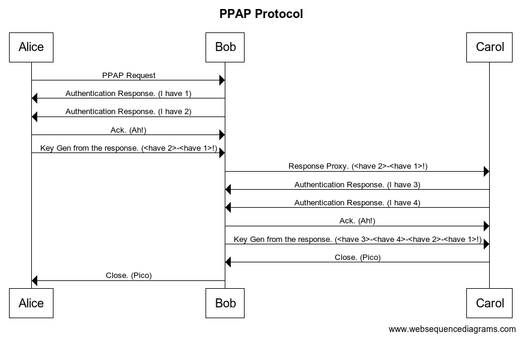

# PPAP protocol

ネタに走ってみたかった。サンタさん僕にクリスマスプレゼントをください。
ちなみにPineappleは酢豚に入れないで欲しい派です🍍

## 元ネタ
```
PPAP
I have a Pen!
I have an Apple!
ah!
Apple-Pen!
I have a Pen!
I have a Pineapple!
ah!
Pineapple-Pen!
Apple-Pen~~
Pineapple-Pen~~
ah!
Pen-Pineapple-Apple-Pen!
Pen-Pineapple-Apple-Pen!
Pico
```

[](http://www.youtube.com/watch?v=0E00Zuayv9Q)

## PPAPプロトコル
* クライアントはサーバに「PPAP」か「(have 1)-(have 2)-...(have n)!」を送る。(シェイクハンド)
* サーバは「I have ~」を送信する。(shard key)
* クライアントは「ah!(ack)」と「haveになってるものをくっつけたもの(e.g. Apple-Pen)」返す。
* サーバーはくっついてるかをチェックしてそれを認証し（認証とはww）、それをバックにいるサーバーにプロキシする
* 今回は深さが「(have 1)-(have 2)-(have 3)-(have 4)!」になったら「Pico(close)」を送る。また、プロキシしてる場合は前のクライアントにパケットを渡す

よく分からないと思うんでこの図を参照


クライアント/サーバ間でやり取りするメッセージ(PPAPパケット)のフォーマットは下図。

```
0                   1                   2                   3
0 1 2 3 4 5 6 7 8 9 0 1 2 3 4 5 6 7 8 9 0 1 2 3 4 5 6 7 8 9 0 1
+-+-+-+-+-+-+-+-+-+-+-+-+-+-+-+-+-+-+-+-+-+-+-+-+-+-+-+-+-+-+-+-+
| Type  |Hoplimt|   Length      |           Padding             |
+-+-+-+-+-+-+-+-+-+-+-+-+-+-+-+-+-+-+-+-+-+-+-+-+-+-+-+-+-+-+-+-+
|                        Origin Address                         |
+-+-+-+-+-+-+-+-+-+-+-+-+-+-+-+-+-+-+-+-+-+-+-+-+-+-+-+-+-+-+-+-+
|                                                               |
|                           Pyload                              |
|                                                               |
+-+-+-+-+-+-+-+-+-+-+-+-+-+-+-+-+-+-+-+-+-+-+-+-+-+-+-+-+-+-+-+-+
```

* 暗号化の仕組みとして innerにデータのペイロードをつけてTypeの部分でPyloadのセマンティクスを書き換える予定だったが面倒なのでやらない
    * Lengthもそんな感じ
* hoplimitはプロキシできる最大数これで無限長PPAPを防ぐ（雑
* Origin Addressは最初の送信元クライアントのアドレスをいれる

## Build
```
make
```

## Run

```
# make netns
sudo ./script/playground.sh
```

以下は全て別々で開いて実行してください
```
sudo ip netns exec HOSTA make crun

sudo ip netns exec HOSTB make sbrun

sudo ip netns exec HOSTC make scrun
```

## 感想
~~貴重なな土日を研究とバイトそっちのけで~~ 楽しんでやったけど滑ったら怖いなと思いました。
